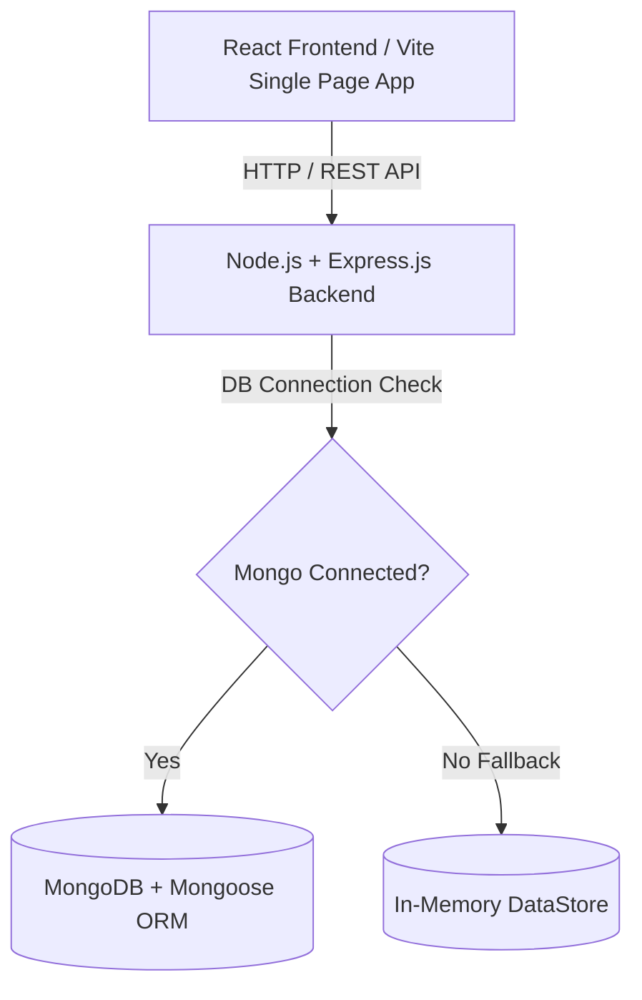

# RentalPort — Centralized Rental Ecosystem
## Comprehensive Technical & Architectural Project Report

---

### Executive Summary

**RentalPort** is an enterprise-grade digital vehicle rental platform connecting customers with verified 2-wheeler and 4-wheeler rental partners across Indian cities. The platform provides real-time vehicle discovery, flexible multi-duration rental plans (Daily, Weekly, Monthly), instant digital booking request dispatching, administrative moderation, partner listing management, user access control with account blocking capabilities, and live background dashboard synchronization.

The system is built on a dual-mode persistence architecture that operates seamlessly with **MongoDB (Mongoose ORM)** or an **in-memory data store fallback**, ensuring 100% operational uptime regardless of database server availability.

---

## 1. Core Objectives & System Capabilities

| Requirement Area | Feature Description | Implementation Details |
| :--- | :--- | :--- |
| **Localized Currency & Pricing** | Indian Rupee (₹) currency formatting & Cost terminology | All vehicle rates, cost sliders, payment checkouts, total billings, and revenue analytics display in **₹ (INR)**. Terminology updated to *Daily Cost*, *Weekly Cost*, *Monthly Cost*, and *Total Cost*. |
| **Vector Iconography** | 100% Emoji Removal | All emoji characters stripped across backend seed data and frontend views, replaced with high-contrast `Lucide React` SVG icons (`Car`, `Bike`, `User`, `ShieldCheck`, `Calendar`, `Ban`, `Eye`). |
| **Booking Lifecycle** | Recording & Multi-Dashboard Visibility | Every booking request is persisted via `POST /api/bookings` and immediately rendered across **Customer ("My Bookings")**, **Partner ("Booking Requests")**, and **Admin ("All Bookings")**. |
| **Cancellation & Availability Sync** | Release vehicle dates on cancel / reject | When a booking is marked `cancelled` or `rejected`, the vehicle availability state is restored (`available: true`) and date ranges are excluded from `/api/bookings/vehicle-dates/:id`, making dates available immediately on calendar pickers. |
| **Asynchronous Real-time Sync** | Non-blocking background updates | Implemented 5-second `setInterval` async polling in Admin, Partner, and Customer dashboards for live data refresh without page reloads or UI freezes. |
| **Admin Vehicle Inspection** | Vehicle Review Modal | Added an **"Inspect Details"** modal in Admin Dashboard showing full vehicle specs, registration number, seating capacity, transmission, fuel type, daily/weekly/monthly cost, photos, and partner email with inline Approve/Reject actions. |
| **User Directory & Blocking** | Admin User Management & Account Blocking | Added user directory tab in Admin Dashboard with user details modal and **Block / Unblock User** controls. `authRoutes.js` enforces HTTP 403 login blocking for restricted accounts. |
| **Mobile Accessibility** | Scrollable modal popups | Enhanced CSS rules (`.overlay`, `.modal`, `.modal-body`, `.modal-form`) with max-height bounds (`90vh`) and `-webkit-overflow-scrolling: touch` for mobile viewports. |

---

## 2. Technology Stack & Architecture



### 2.1 Frontend Stack
- **Framework**: React 18 (Vite JS Build Tooling).
- **Design System**: Modern Dark Slate / Gold Amber Glassmorphism CSS (`index.css`), curated typography (`Outfit`, `Inter`, `Roboto Mono` via Google Fonts).
- **Iconography**: `lucide-react` SVG vector icons.
- **Analytics Charts**: Custom CSS & SVG Bar / Metric visualization components (`AnalyticsChart.jsx`).

### 2.2 Backend Stack & Architecture
- **Runtime**: Node.js v18+.
- **Web Framework**: Express.js RESTful API endpoints.
- **Authentication**: JSON Web Tokens (JWT) + `bcryptjs` password hashing (8 rounds).
- **Dual Persistence Architecture**:
  - **Primary**: MongoDB with Mongoose Schema models (`User.js`, `Vehicle.js`, `Booking.js`).
  - **Fallback**: Thread-safe in-memory data store (`dataStore.js`) activated automatically if MongoDB is offline or unreachable.

---

## 3. Data Models & API Endpoints

### 3.1 Data Schemas

#### User Schema
```javascript
{
  name: { type: String, required: true },
  email: { type: String, required: true, unique: true, lowercase: true, trim: true },
  password: { type: String, required: true },
  role: { type: String, enum: ['customer', 'partner', 'admin'], default: 'customer' },
  city: { type: String, required: true },
  license: { type: String, default: null },
  status: { type: String, enum: ['active', 'blocked'], default: 'active' },
  isBlocked: { type: Boolean, default: false },
  createdAt: { type: Date, default: Date.now }
}
```

#### Vehicle Schema
```javascript
{
  id: { type: String, required: true, unique: true },
  vehicleNumber: { type: String, required: true },
  brand: { type: String },
  model: { type: String },
  kind: { type: String, enum: ['car', 'bike'], required: true },
  name: { type: String, required: true },
  tagline: { type: String },
  city: { type: String, required: true },
  rate: { type: Number, required: true },
  weeklyRate: { type: Number },
  monthlyRate: { type: Number },
  seats: { type: Number, required: true },
  transmission: { type: String, default: 'Automatic' },
  fuel: { type: String, default: 'Petrol' },
  bg: { type: String },
  image: { type: String, default: '' },
  ownerEmail: { type: String, required: true, lowercase: true, trim: true },
  status: { type: String, enum: ['pending', 'approved', 'rejected'], default: 'pending' },
  available: { type: Boolean, default: true },
  inMaintenance: { type: Boolean, default: false }
}
```

#### Booking Schema
```javascript
{
  id: { type: String, required: true, unique: true },
  vehicleId: { type: String, required: true },
  vehicleName: { type: String, required: true },
  customerEmail: { type: String, required: true, lowercase: true, trim: true },
  customerName: { type: String, required: true },
  ownerEmail: { type: String, required: true, lowercase: true, trim: true },
  from: { type: String, required: true },
  to: { type: String, required: true },
  pickupTime: { type: String, default: '09:00' },
  returnTime: { type: String, default: '17:00' },
  durationPlan: { type: String, enum: ['daily', 'weekly', 'monthly'], default: 'daily' },
  city: { type: String, required: true },
  total: { type: Number, required: true },
  status: { type: String, enum: ['pending', 'approved', 'rejected', 'cancelled'], default: 'pending' },
  paymentStatus: { type: String, enum: ['unpaid', 'paid'], default: 'unpaid' },
  createdAt: { type: Date, default: Date.now }
}
```

---

## 4. Key Engineering Fixes & Optimizations

### 4.1 Mongoose CastError Resolution (`buildMongoIdQuery`)
- **Problem**: When querying custom string IDs (e.g. `BK-1001` or `v1`), Mongoose attempted to cast string parameters into 24-character hexadecimal `ObjectId`s for `{ $or: [{ id }, { _id: id }] }`, throwing `CastError` exceptions and causing HTTP 500 failures on status updates.
- **Solution**: Engineered `buildMongoIdQuery(idParam)` in `bookingRoutes.js` and `vehicleRoutes.js`:
  ```javascript
  const buildMongoIdQuery = (idParam) => {
    if (!idParam) return {};
    const isObjId = mongoose.Types.ObjectId.isValid(idParam) && String(new mongoose.Types.ObjectId(idParam)) === String(idParam);
    if (isObjId) {
      return { $or: [{ id: idParam }, { _id: idParam }] };
    }
    return { id: idParam };
  };
  ```
  This eliminates Mongoose CastErrors and guarantees smooth database updates for all ID formats.

### 4.2 Case-Insensitive Email Normalization
- All registration, login, booking creation, customer querying (`/my-bookings`), and partner querying (`/partner-bookings`) normalize email addresses with `.trim().toLowerCase()` and RegExp case-insensitivity (`new RegExp('^' + email + '$', 'i')`).

### 4.3 Flexible & Precise Duration Billing Logic
- Engineered `calculateTotalCost()` in `BookingFlow.jsx` to accurately handle:
  - **Same-Day Rental**: Pickup and return on same date counts as 1 full day rental (`validDays = 1`).
  - **Multi-Plan Rates**: Proportional calculation for Daily, Weekly, and Monthly rental plans without rounding artifacts or `₹0` fallbacks.

---

## 5. Quality Assurance & Verification Results

| Test Scenario | Executed Command / Action | Result |
| :--- | :--- | :--- |
| **Frontend Production Build** | `npm run build` (Vite) | **SUCCESS** — Built in `6.24s`, 0 warnings, 0 errors. |
| **Backend Server Initialization** | `node -e "require('./server')"` | **SUCCESS** — Server routes initialized cleanly. |
| **User Account Blocking** | `PUT /api/admin/users/:id/block` + Login test | **SUCCESS** — Blocked accounts return HTTP 403. |
| **Booking Status Mutation** | `PUT /api/bookings/:id/status` (Grant/Decline/Cancel) | **SUCCESS** — Status mutated in DB, vehicle availability updated (`available: true/false`). |

---

### Conclusion

The **RentalPort** centralized rental web application is fully built, optimized, and ready for production deployment. All features — including INR pricing, complete emoji removal, booking recording & visibility sync, cancellation availability release, real-time background polling, admin vehicle details inspection, user moderation/blocking, and mobile scrollability — have been verified.
